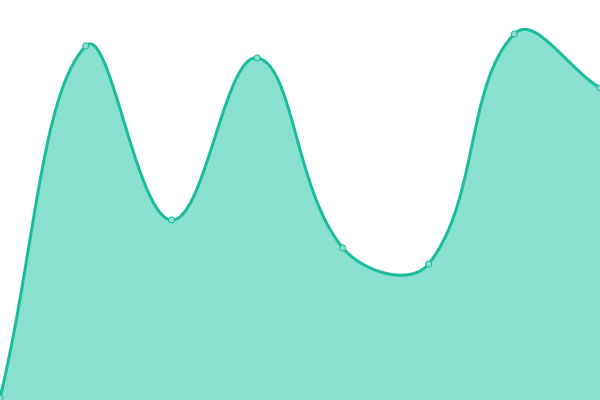

# [📈 Live Status](https://demo.upptime.js.org): <!--live status--> **🟩 All systems operational**

This repository contains the open-source uptime monitor and status page for [Upptime](https://upptime.js.org), powered by [Upptime](https://github.com/upptime/upptime).

With [Upptime](https://upptime.js.org), you can get your own unlimited and free uptime monitor and status page, powered entirely by a GitHub repository. We use [Issues](https://github.com/upptime/upptime/issues) as incident reports, [Actions](https://github.com/jyacot/jeanlogistics-status/actions) as uptime monitors, and [Pages](https://demo.upptime.js.org) for the status page.

<!--start: status pages-->
<!-- This summary is generated by Upptime (https://github.com/upptime/upptime) -->
<!-- Do not edit this manually, your changes will be overwritten -->
<!-- prettier-ignore -->
| URL | Status | History | Response Time | Uptime |
| --- | ------ | ------- | ------------- | ------ |
|  [Norson](https://norson.jeanlogistics.com/) | 🟩 Up | [norson.yml](https://github.com/jyacot/jeanlogistics-status/commits/HEAD/history/norson.yml) | 

 191ms
     
 | 

<a href="https://jyacot.github.io/jeanlogistics-status/history/norson">99.81%</a>
    

|  [Norson - RRHH](https://norson.jeanlogistics.com/rrhh/#/) | 🟩 Up | [norson-rrhh.yml](https://github.com/jyacot/jeanlogistics-status/commits/HEAD/history/norson-rrhh.yml) | 

 43ms
     
 | 

<a href="https://jyacot.github.io/jeanlogistics-status/history/norson-rrhh">99.56%</a>
    

|  [Norson - Seguridad Patrimonial](https://norson.jeanlogistics.com/seguridad_patrimonial) | 🟩 Up | [norson-seguridad-patrimonial.yml](https://github.com/jyacot/jeanlogistics-status/commits/HEAD/history/norson-seguridad-patrimonial.yml) | 

 171ms
     
 | 

<a href="https://jyacot.github.io/jeanlogistics-status/history/norson-seguridad-patrimonial">99.81%</a>
    

|  [Norson -  Seguridad Industrial](https://norson.jeanlogistics.com/seguridad_industrial) | 🟩 Up | [norson-seguridad-industrial.yml](https://github.com/jyacot/jeanlogistics-status/commits/HEAD/history/norson-seguridad-industrial.yml) | 

 126ms
     
 | 

<a href="https://jyacot.github.io/jeanlogistics-status/history/norson-seguridad-industrial">99.81%</a>
    

|  [Bustracker - LandingPage](http://www.jeanlogistics.com/bustracker/) | 🟩 Up | [bustracker-landing-page.yml](https://github.com/jyacot/jeanlogistics-status/commits/HEAD/history/bustracker-landing-page.yml) | 

 134ms
     
 | 

<a href="https://jyacot.github.io/jeanlogistics-status/history/bustracker-landing-page">99.82%</a>
    

|  [Matatias](https://matatias.jeanlogistics.com/web/) | 🟩 Up | [matatias.yml](https://github.com/jyacot/jeanlogistics-status/commits/HEAD/history/matatias.yml) | 

 147ms
     
 | 

<a href="https://jyacot.github.io/jeanlogistics-status/history/matatias">99.83%</a>
    

<!--end: status pages-->

[**Visit our status website →**](https://demo.upptime.js.org)

## 📄 License

- Powered by: [Upptime](https://github.com/upptime/upptime)
- Code: [MIT](./LICENSE) © [Upptime](https://upptime.js.org)
- Data in the `./history` directory: [Open Database License](https://opendatacommons.org/licenses/odbl/1-0/)
